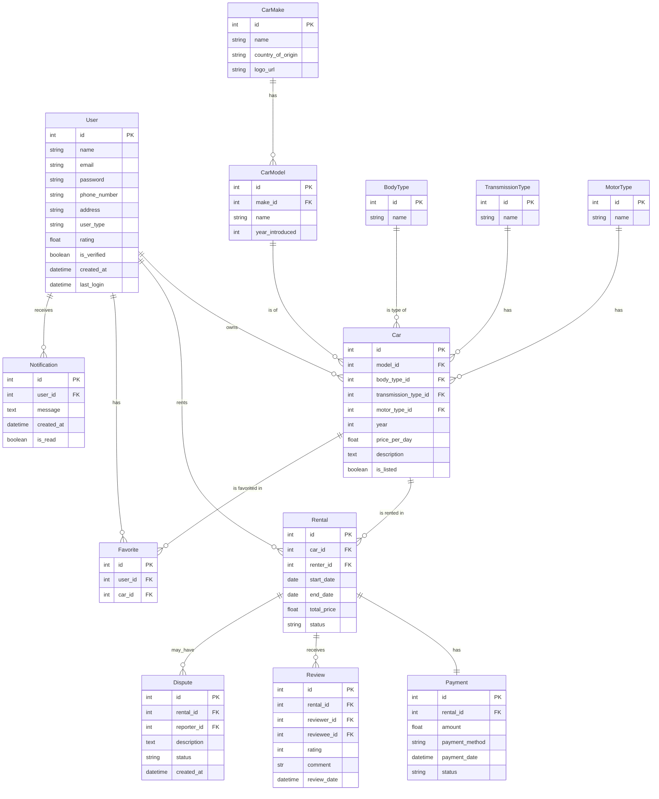

```mermaid
erDiagram
    User ||--o{ Car : owns
    User ||--o{ Rental : rents
    User {
        int id PK
        string name
        string email
        string password
        string phone_number
        string address
        string user_type
        float rating
        boolean is_verified
        datetime created_at
        datetime last_login
    }
    Car ||--o{ Rental : "is rented in"
    Car ||--o{ Favorite : "is favorited in"
    CarMake ||--o{ CarModel : has
    CarModel ||--o{ Car : "is of"
    BodyType ||--o{ Car : "is type of"
    TransmissionType ||--o{ Car : has
    MotorType ||--o{ Car : has
    Car {
        int id PK
        int model_id FK
        int body_type_id FK
        int transmission_type_id FK
        int motor_type_id FK
        int year
        float price_per_day
        text description
        boolean is_listed
    }
    CarMake {
        int id PK
        string name
        string country_of_origin
        string logo_url
    }
    CarModel {
        int id PK
        int make_id FK
        string name
        int year_introduced
    }
    BodyType {
        int id PK
        string name
    }
    TransmissionType {
        int id PK
        string name
    }
    MotorType {
        int id PK
        string name
    }
    Rental {
        int id PK
        int car_id FK
        int renter_id FK
        date start_date
        date end_date
        float total_price
        string status
    }
    Payment {
        int id PK
        int rental_id FK
        float amount
        string payment_method
        datetime payment_date
        string status
    }
    Review {
        int id PK
        int rental_id FK
        int reviewer_id FK
        int reviewee_id FK
        int rating
        str comment
        datetime review_date
    }
    Favorite {
        int id PK
        int user_id FK
        int car_id FK
    }
    Notification {
        int id PK
        int user_id FK
        text message
        datetime created_at
        boolean is_read
    }
    Dispute {
        int id PK
        int rental_id FK
        int reporter_id FK
        text description
        string status
        datetime created_at
    }
    Rental ||--|| Payment : has
    Rental ||--o{ Review : receives
    User ||--o{ Favorite : has
    User ||--o{ Notification : receives
    Rental ||--o{ Dispute : may_have
```
